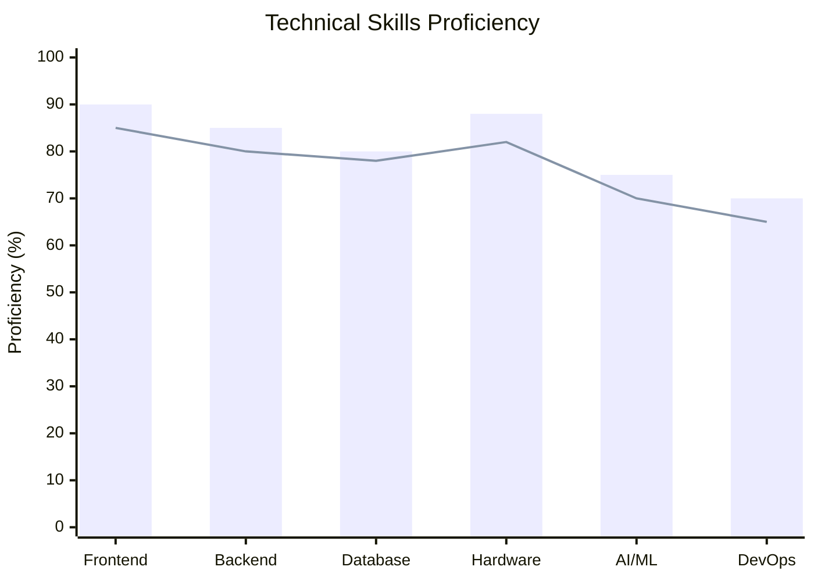
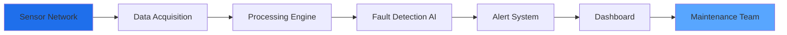
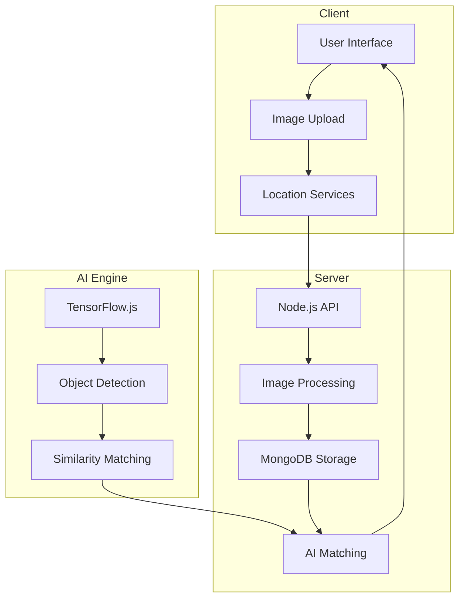
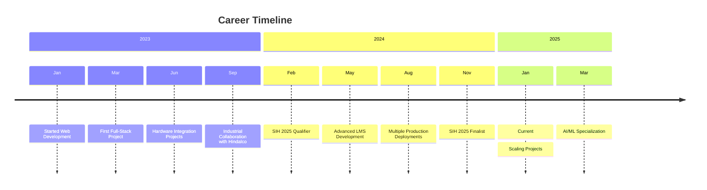
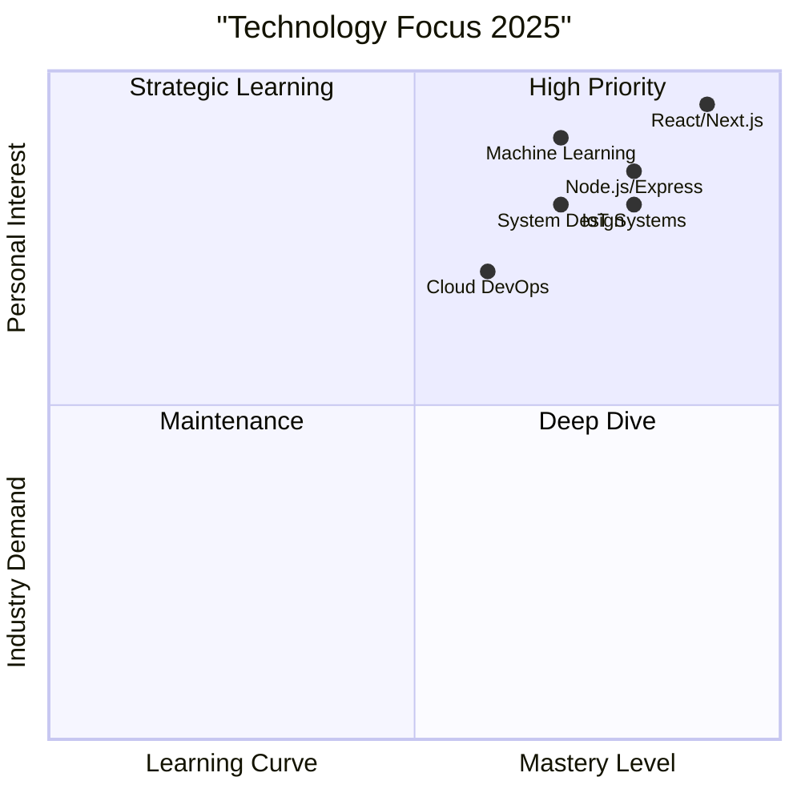

# <h1 align="center">👋 Hi, I'm Kshitij Kumar</h1>
<h3 align="center">🚀 SIH 2025 Finalist | B.Tech CSE (AI & ML) | Full-Stack Developer | Hardware-Software Integration Specialist</h3>

<p align="center">
  <a href="https://www.linkedin.com/in/kshitij-kumar-766852298">
    
  </a>
  <a href="https://github.com/Vkaran0">
    
  </a>
  <a href="mailto:kshitijups2@gmail.com">
    
  </a>
  <a href="https://leetcode.com/u/Vkshitij07/">
    
  </a>
</p>

<div align="center">
  
</div>

---

## 📊 GitHub Analytics Dashboard

<div align="center">

### 🏆 GitHub Profile Stats


### 📈 Activity Graph
[](https://github.com/ashutosh00710/github-readme-activity-graph)

### 💻 Top Languages


### 🏅 GitHub Trophies


</div>

---

## 🚀 About Me

<div align="center">
  
  
  
  
  
</div>

Hello! I'm **Kshitij Kumar**, a passionate **Software Developer** specializing in **Full-Stack Development** and **Hardware-Software Integration**. With hands-on experience in building industry-level projects, I bridge the gap between software applications and physical hardware systems.

**🎯 Key Highlights:**
- 🏭 **Industrial Project Experience** with Hindalco Industries
- 🏆 **SIH 2025 Finalist** - Smart India Hackathon
- 🌐 **Full-Stack Developer** (MERN Stack Specialist)
- 🔌 **Hardware-Software Integration Expert**
- 🎓 **B.Tech in Computer Science (AI & ML)**

---

## 🛠️ Tech Stack & Skills

### **🌐 Frontend Development**


### **⚙️ Backend Development**


### **🗄️ Databases**


### **🔧 Hardware & Embedded**


---

## 📊 Skill Proficiency



### **Weekly Development Focus**
```text
🌐 Frontend Development    ████████████░░░ 92%
⚙️  Backend Development    ███████████░░░░ 88%
🗄️  Database Management   █████████░░░░░░ 82%
🔌 Hardware Integration    ██████████░░░░░ 85%
🤖 AI/ML Fundamentals      ███████░░░░░░░░ 75%
🔧 DevOps Practices        ██████░░░░░░░░░ 70%
📱 Mobile Development      ████████░░░░░░░ 78%
🔐 Security                ███████░░░░░░░░ 76%
```

---

## 🏭 Industrial Projects

### **🏢 Industrial Fault Detection System** 
**Client: Hindalco Industries | Duration: 6 Months**

<div align="center">
  
</div>

**Key Achievements:**
- ✅ Reduced machine downtime by 40%
- ✅ Increased fault detection accuracy to 95%
- ✅ Implemented real-time monitoring dashboard
- ✅ Integrated 15+ hardware sensors with software analytics

**System Architecture:**


---

## 💻 Featured Projects

### **1. 🎓 Advanced Learning Management System (LMS)**
**Full-stack educational platform with modern features**

<div align="center">
  
</div>

**Features:**
- 📚 Course creation and management system
- 👨‍🏫 Virtual classroom with real-time interaction
- 📊 Advanced analytics and progress tracking
- 📱 Fully responsive design (Mobile-First)
- 🔒 Secure authentication (JWT + OAuth)

**Metrics:**


---

### **2. 🚗 Ride Matching Platform**
**Peer-to-peer ride sharing application**

<div align="center">
  
</div>

**Features:**
- 🗺️ Real-time GPS tracking and mapping
- 💰 Dynamic fare calculation algorithm
- ⭐ User rating and review system
- 🔐 Secure payment gateway integration
- 📱 Cross-platform mobile application

**Tech Stack:**


---

### **3. 🔍 Lost & Found Portal**
**Community-based item recovery system**

<div align="center">
  
</div>

**Features:**
- 🖼️ Image recognition for item identification
- 📍 Location-based search functionality
- 🔔 Real-time notification system
- 👥 Community verification mechanism
- 📊 Admin dashboard for moderation

**Technology Flow:**


---

## 📈 Project Statistics

<div align="center">

| Project | Stars | Forks | Issues | Status |
|---------|-------|-------|--------|--------|
| **LMS Platform** |  |  |  |  |
| **Ride Matching** |  |  |  |  |
| **Lost & Found** |  |  |  |  |

</div>

---

## 🏆 Achievements & Certifications



**Badges & Certifications:**
<div align="center">
  
  
  
  
</div>

---

## 🔥 Current Focus & Goals



**🎯 2025 Goals:**
- 📊 Master System Design & Architecture
- 🤖 Deep dive into AI/ML implementations
- ☁️ Learn AWS/Azure Cloud deployment
- 🚀 Contribute to open-source projects
- 📝 Publish technical articles

---

## 📫 Connect With Me

<div align="center">

[](https://www.linkedin.com/in/kshitij-kumar-766852298)
[](https://github.com/Vkaran0)
[](mailto:kshitijups2@gmail.com)
[](https://twitter.com/your-handle)
[](https://leetcode.com/u/Vkshitij07/)
[](https://your-portfolio.vercel.app)

</div>

---

## 📊 Visitor Analytics

<div align="center">
  


</div>

---

<div align="center">

### ⚡ **Fun Fact**
```python
while learning:
    code()
    debug()
    deploy()
    repeat()
```

⭐ **"Code is like humor. When you have to explain it, it's bad." - Cory House**

---
*Last Updated: January 2025 | Made with ❤️ by Kshitij Kumar*

</div>
